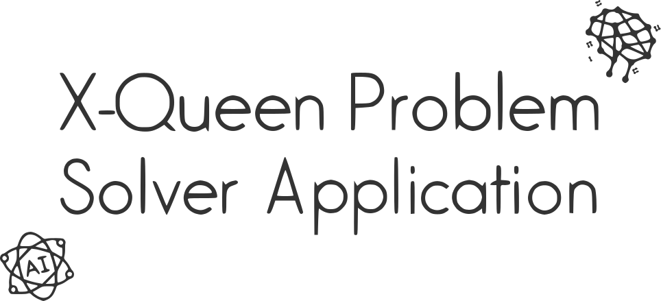
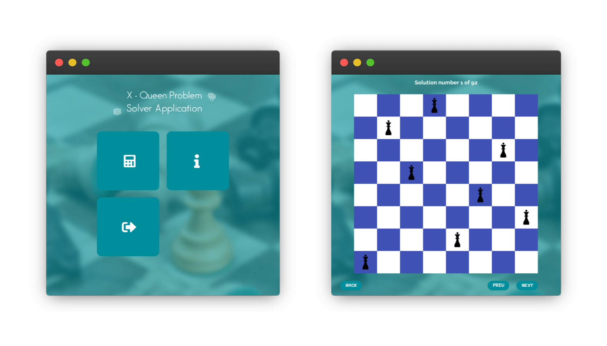

<h1 align='center'></h1>

* A desktop application is developed using [PyGame](https://www.pygame.org) framework.

* The application allows users to choose the problem from a 4-queen problem to a 13-queen problem (10 cases), then display all possible solutions (queens locations) on the chessboard.

* The application displays all solutions for all cases at the same time (about 2s while preparing the chessboard).

* Cases solutions are stored into lists embedded with the application code lines.

* We used the OR tools solution to the [N-Queens Problem](https://developers.google.com/optimization) from Google to prepare the data of the cases' solutions.

 

## App View

 

## Download Link
<a href='./Installation Setup/X-Queen Problem Solver Application.exe' download>⬇ Click here</a> to download the installation setup.

 

## Technologies Used
* 
* 
* 

 

## Features
* 🖼 Elegant UI including 5 pages
* 👓 UI elements with interactive effects
* ℹ️ About page for the application details
* ⚡ Support fully solutions for 10 cases of the n-queen problem
* 🔃 Loading page with elegant animation
* ♟ Chessboard with options to see all solutions to the chosen problem
* 🔙 Three pages include a back button

 

## Team
* Mohammad Jarab'ah | UI & AI
* Samah Rbeihat | AI

 

## Credits
* Icons are from [Font Awesome](https://fontawesome.com), [Flat Icon](https://www.flaticon.com)
* Images are from [Unsplash](https://unsplash.com)
* Font is from [Google Fonts](https://fonts.google.com)
